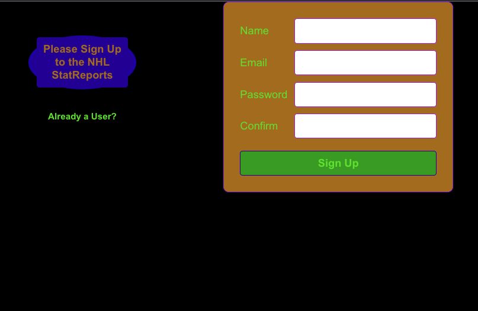
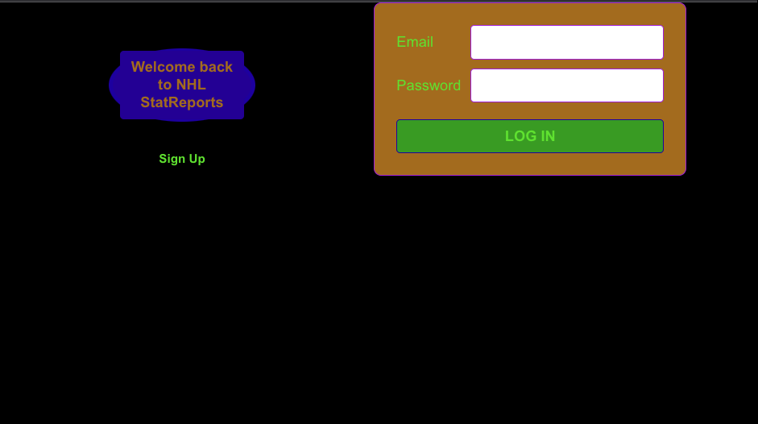
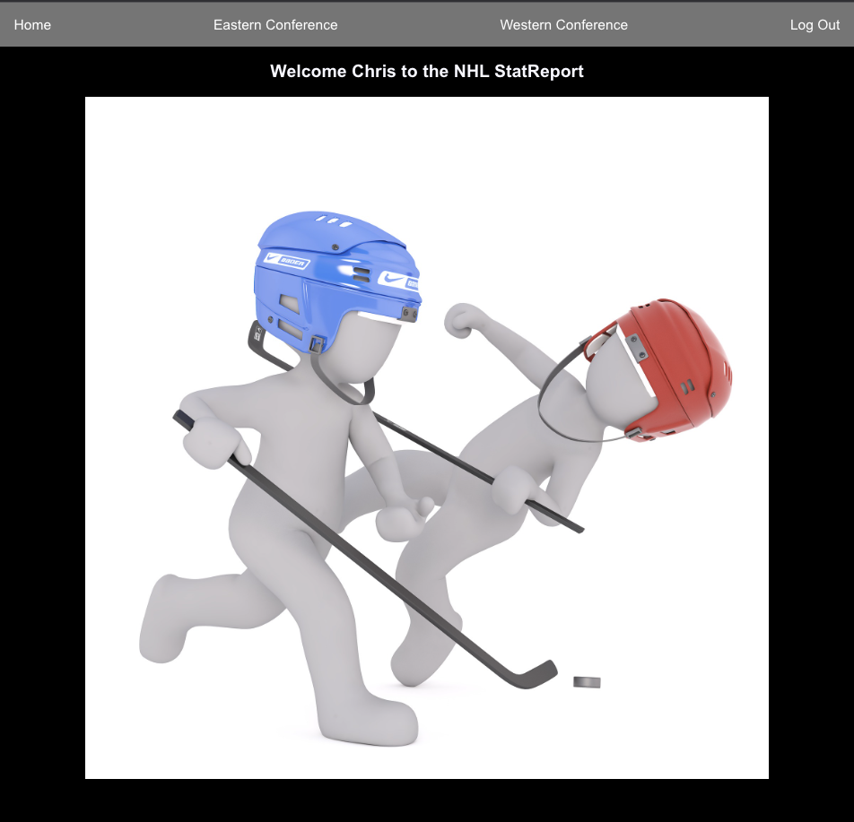
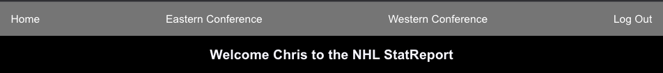

# Welcome to the NHL StatReport

Welcome to the NHL Statreport which allows you to create a useer login and then view a Home page that gives you access to the NHL Hockey Conferences.  By choosing a conference you will then have the ability to see the two divisions that are established within each of the NHL Conferences.  Each Division when chosen will give you the complete list of teams in that divison and are availabe for viewing.  Upon choosing a team then you will have the pleasure of viewing some general team knowledge and viewing their Official NHL Team website.

# Viewing the Website on Heroku
Open [https://nhl-statreport.herokuapp.com/](https://nhl-statreport.herokuapp.com/)

Upon opening the app on Heroku you will be presented with the very minimalistic styling.
# Create User/Login Form

The authorization page allows the user to choose between creating a new account or if they are a current user to log themselves in using this form:

# HOME Page

This is where the user is welcomed given access to view the websites features.
The first is the use of the navigation bar which allows them the choice of choosing either the Eastern or Western Conferences.

